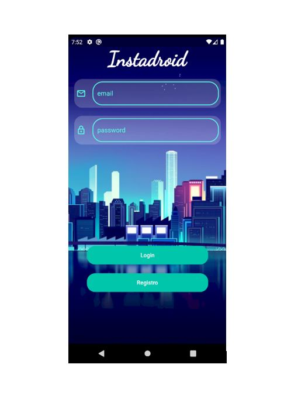
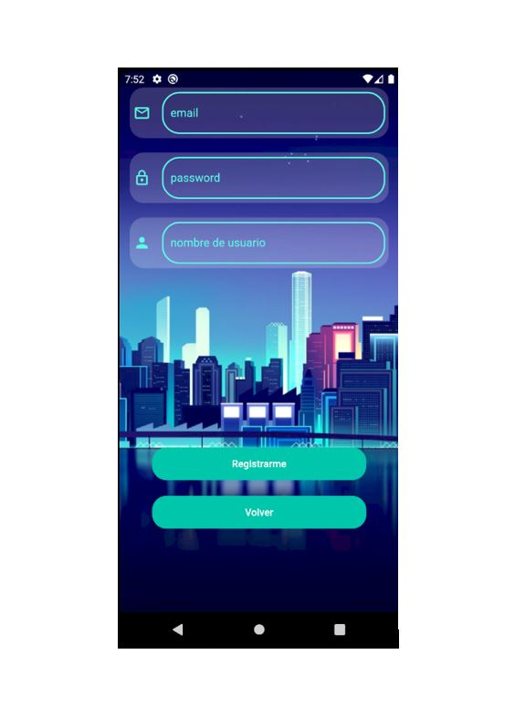
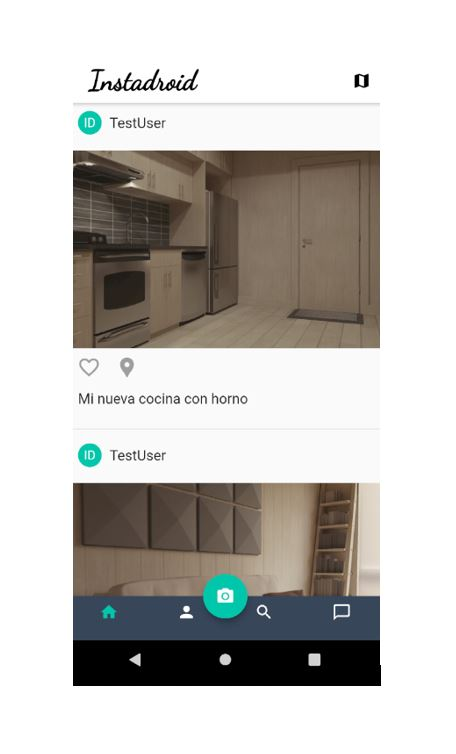
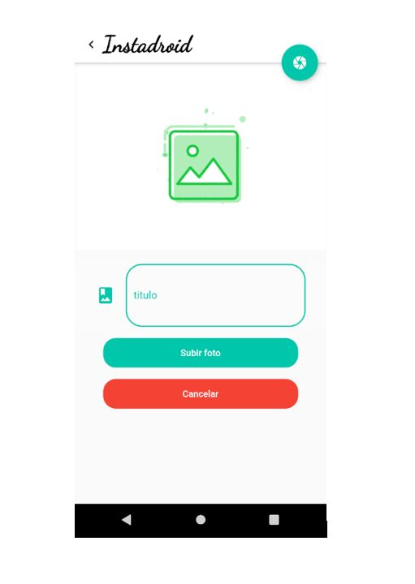
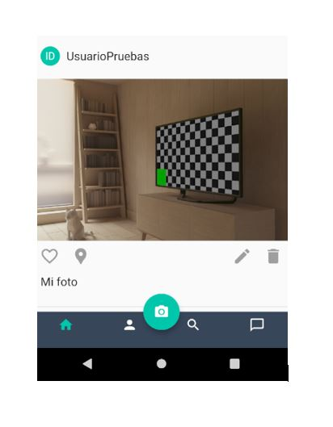
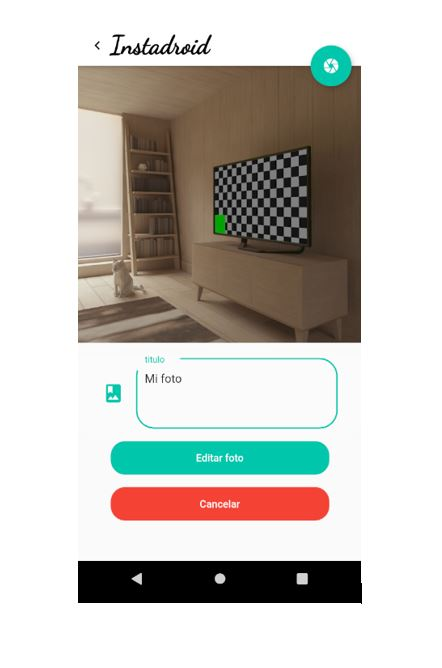
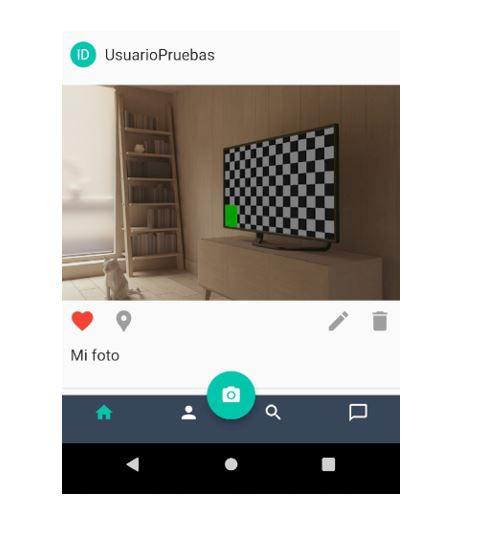
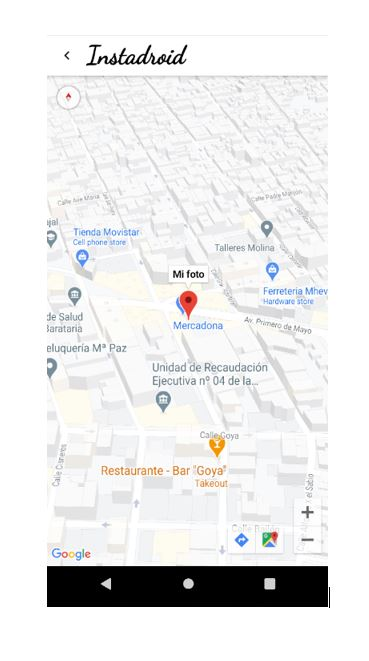
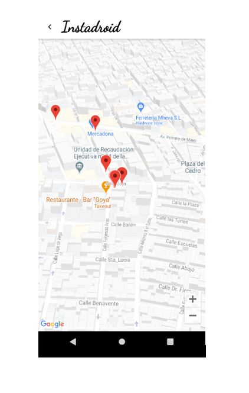

<html lang="es">
  <head>
    <!-- Required meta tags -->
    <meta charset="utf-8">
    <meta name="viewport" content="width=device-width, initial-scale=1, shrink-to-fit=no">

    <link rel="stylesheet" href="https://maxcdn.bootstrapcdn.com/bootstrap/4.0.0/css/bootstrap.min.css" integrity="sha384-Gn5384xqQ1aoWXA+058RXPxPg6fy4IWvTNh0E263XmFcJlSAwiGgFAW/dAiS6JXm" crossorigin="anonymous">

    <title>Hello, world!</title>
    
  </head>
 
  <body>
        

            <h1 class="display-4">Guía de usuario de Instadroid</h1>
            
Aquí podrás encontrar lo necesario para manejar la aplicación

            

            
Guía de los aspectos más relevantes de la aplicación

        

    

        

            
            

              
Esta es la pantalla de login, aquí podrás entrar a Instadroid si ya tienes una cuenta
              o pulsar en registro para crear una nueva.

            

        

        

            
            

              
Esta es la pantalla de registro, rellena correctamente tus credenciales y crea una cuenta

            

        

        

            
            

              
Este es el timeline de Instadroid, aquí podras ver las fotos que suben los usuarios. Además
              con el menú inferior podrás acceder a nuevas funcionalides pronto disponibles. Para subir una foto pulsa el icono     de la cámara en el menú inferior

            

        

        

            
            

              
Esta es la pantalla para subir una foto, pulsa al botón de arriba a la derecha y elige si    echar la foto con la cámara o sacarla desde la galería. A continuación, dale un título y pulsa en subir foto

            

        

        

            
            

              
Este es el aspecto que muestra tu publicación recién subida. Verás las opciones de borrar y
              editar en la parte inferior derecha de la foto.Pulsa en el icono de la papelera para borrar la publicación

            

        

        

            
            

              
Esta es la pantalla para editar una foto. Funciona exactamente igual que la pantalla para    subirla!

            

        

        

            
            

              
Pulsa en el icono del corazón de una publicación para darle like

            

        

        

            
            

              
Pulsa en el icono de la localización para acceder a esta pantalla y ver dónde
              se realizó la publicación

            

        

        

            
            

              
Pulsa en el icono del mapa de la barra superior del timeline para ver esta pantalla
              con la localización de todas las publicaciones

            

        

    

    

    
    
    
  </body>
</html>